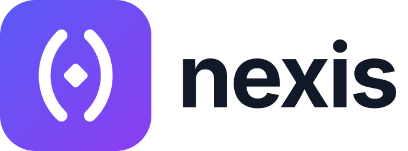
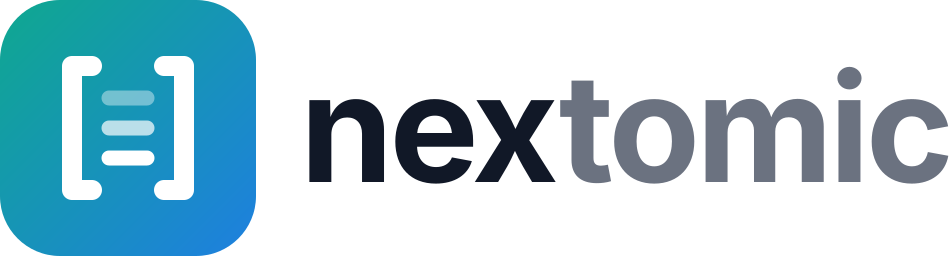

<p align="center"></p>

> **Clojure's language on a Zig-native runtime, with a Datomic-class
> database inside.** Persistent collections, macros, keywords,
> destructuring and lexical closures as Clojure has them; one static
> binary that starts instantly; durable identity as a value kind; and
> Nextomic, immutable facts with time, Datalog, `as-of`, `since` and
> `history`, in one file. **Not a Clojure port**: no Java interop, no
> STM, one isolate, one thread.

## What you can do with it

Reach for nexis wherever you would write a Clojure script or a small
program with its own database, and would rather not start a JVM or run
a server. It is one binary that starts in about 5 ms, and its database
lives in the same process and in one file you can copy, back up or
throw away.

- **Scripts and one-liners.** Clojure as you write it, at shell speed:

  ```bash
  ./bin/nexis -e '(->> (range 10) (filter odd?) (map #(* % %)) (reduce +))'   # 165
  ```

- **Programs that remember.** Durable refs (`db/*`) keep named values
  on disk with transactions and rollback; `examples/todo-app.nx` is a
  to-do tracker whose second run starts where the first left off.
- **A database with a memory.** Nextomic keeps every fact it has ever
  been told. Ask about the present, ask how things stood at any earlier
  moment, or try a change without keeping it:

  ```clojure
  (require '[nextomic :as d])
  (def conn (d/connect "people.edb"))
  (d/transact! conn [{:db/ident :person/name :db/valueType :db.type/string
                      :db/cardinality :db.cardinality/one :db/unique :db.unique/identity}
                     {:db/ident :person/age :db/valueType :db.type/long
                      :db/cardinality :db.cardinality/one}])
  (d/transact! conn [{:person/name "Ada" :person/age 36} {:person/name "Alan" :person/age 41}])
  (def before (d/db conn))                                   ; a snapshot that never changes
  (d/transact! conn [{:person/name "Ada" :person/age 37}])   ; upserts Ada by name
  (d/q '[:find ?n ?a :where [?e :person/name ?n] [?e :person/age ?a] [(> ?a 36)]] (d/db conn))
  ;; => #{["Ada" 37] ["Alan" 41]}
  (:person/age (d/entity before [:person/name "Ada"]))       ;; => 36: the past is still there
  ```

  Every commit, Nextomic's and `db/*`'s, is on the disk when it
  returns; a program of many small transactions can trade that for
  speed with `{:durability :commit}` (`docs/DB.md` §3.3).

It suits local-first tools and command-line programs that need real
history (audit trails, "what did this look like last Tuesday", undo),
small services and batch jobs where a database server would be
overkill, and exploring data at a REPL against a file. It does not run
Java libraries, and it is single-threaded.

**Five minutes in:** install it (below), run `./bin/nexis repl` and try
the lines under [The language](#the-language); read
[`docs/GUIDE.md`](docs/GUIDE.md), nexis for Clojure programmers; run
`./bin/nexis run examples/nextomic-app.nx` for a fuller database tour
(a clinic chart with patients, visits, notes and time travel); browse
`examples/README.md` for the other programs. Every library function
documents itself: `(doc map)`, `(dir nexis.string)`, `(apropos
"split")` at the REPL, or `nexis doc map` from the shell.

## How it is built

nexis is a reader, a macroexpander, a compiler to 64-bit bytecode, a
slot VM, persistent collections (CHAMP maps and sets, 32-way vectors,
lists, transients), a 16-byte tagged value and a precise mark-sweep
collector, all in Zig. Under it sit two sibling projects: **emdb**,
a memory-mapped MVCC B+ tree storage engine, and **nexus**, the parser
generator that builds the reader's grammar.

## Install

Each release on GitHub (`https://github.com/shreeve/nexis/releases`)
carries `bin/nexis` for three targets: `x86_64-linux-musl` (static,
any x86-64 CPU with SSE4.2 and POPCNT), `aarch64-linux-musl` (static)
and `aarch64-macos` (Apple silicon, macOS 15 or later). Each archive
holds one directory, `nexis-VERSION-TARGET/`, with `bin/nexis`, this
README, `LICENSE` and `BUILD-INFO`, which names the nexis commit, the
emdb commit and the Zig release it was built from; `SHA256SUMS` lists
every archive's checksum.

```bash
v=0.1.0 target=aarch64-macos            # or x86_64-linux-musl, aarch64-linux-musl
base=https://github.com/shreeve/nexis/releases/download/v$v
curl -LO $base/nexis-$v-$target.tar.gz -O $base/SHA256SUMS
shasum -a 256 -c --ignore-missing SHA256SUMS   # or: sha256sum -c --ignore-missing SHA256SUMS
tar -xzf nexis-$v-$target.tar.gz
mkdir -p ~/.local/bin && cp nexis-$v-$target/bin/nexis ~/.local/bin/   # a directory on PATH
nexis --version                         # nexis 0.1.0
```

On macOS an archive downloaded through a browser is quarantined, and
so is what it unpacks to; `curl` leaves no mark, and `xattr -d
com.apple.quarantine` on the binary clears one.

**Versions and stores.** A release is a tag `vX.Y.Z` of this
repository's source; `nexis --version` names it, and `BUILD-INFO` the
emdb commit beneath it. A store file carries between
hosts but not between releases: emdb's file format is not frozen and
emdb does not migrate a file from one format to another, so a release
may refuse a store another release wrote. Recreate a store, or
re-import its data, after upgrading (`docs/DB.md` §1,
`docs/NEXTOMIC.md` §2).

## Build from source

Building takes Zig 0.17.0 and a sibling checkout of emdb (`../emdb`),
the storage engine compiled into every binary. emdb's repository is
private, so only those with access to it can build from source; a
release's binaries have it compiled in.

```bash
zig build install                      # bin/nexis

./bin/nexis run examples/hello.nx      # run a file (also: bin/nexis FILE.nx)
./bin/nexis -e '(reduce + (range 101))'  # evaluate an expression: 5050
echo '(println :hi)' | ./bin/nexis run -  # a program from stdin
./bin/nexis repl                       # read-eval-print loop; :quit or Ctrl-D exits
./bin/nexis test my_tests.nx           # run files, then every deftest they define
./bin/nexis doc map                    # a function's documentation
./bin/nexis disasm examples/hello.nx   # every routine's bytecode with source positions
./bin/nexis --help
./bin/nexis --version                  # nexis 0.1.0
```

`nexis run` prints only what the program prints; the REPL and `-e`
print each value. Exit status is 0 on success, 3 for a parse or reader
error, 4 for a compile error, 5 for an uncaught runtime error, and `n`
for `(exit n)` (`docs/TOOLING.md` §1).

`zig build test --summary all` is the gate; `HANDOFF.md` §2 carries its
count of record and `AGENTS.md` lists every build step.

## The language

Each line prints the value after `;; =>` when run with `bin/nexis`
(wrap it in `prn` under `nexis run`):

```clojure
(let [x 5] ((fn [y] (+ x y)) 3))            ;; => 8
(loop [i 0 acc 0]
  (if (< i 10) (recur (+ i 1) (+ acc i)) acc)) ;; => 45, constant stack

(defmacro unless [test & body]
  `(if ~test nil (do ~@body)))
(unless false :got-it)                      ;; => :got-it

(let [{:keys [x y] :or {y 10}} {:x 5}] (+ x y)) ;; => 15
(defn arity ([x] :one) ([x y] :two) ([x y & r] :many))
(arity :a :b :c)                            ;; => :many

(:a {:a 1})                                 ;; => 1, keyword as function
(#{1 2} 2)                                  ;; => 2, set as function
('b {'b 2})                                 ;; => 2, symbol as function
(+ 1 2.5)                                   ;; => 3.5, contagion
(= 1 1.0)                                   ;; => false
(== 1 1.0)                                  ;; => true
(* 1000000000 1000000000)                   ;; => 1000000000000000000, a bignum
(try (/ 1 0) (catch any e e))               ;; => :divide-by-zero
(re-seq #"(\w+)=(\d+)" "a=1 b=22")           ;; => (["a=1" "a" "1"] ["b=22" "b" "22"])
(nexis.string/replace "2026-10-06" #"(\d+)-(\d+)-(\d+)" "$3/$2/$1") ;; => "06/10/2026"

(map inc [1 2 3])                           ;; => (2 3 4), lazy
(take 3 (iterate #(* 2 %) 1))               ;; => (1 2 4)
(for [x (range 3) :when (odd? x)] [x (* x x)]) ;; => ([1 1])
(-> {:a 1} (assoc :b 2) (update :a inc))    ;; => {:a 2, :b 2}
(persistent! (reduce conj! (transient []) (range 5))) ;; => [0 1 2 3 4]

(ns my.app)
(defn double [x] (* x 2))
(ns user)
(my.app/double 21)                          ;; => 42
(require '[lib.geom :as g])                 ;; examples/lib/geom.nx
(g/area-of-square 5)                        ;; => 25

(defprotocol Area (area [s]))
(defrecord Square [side])
(extend-protocol Area Square (area [s] (* (:side s) (:side s))))
(area (->Square 3))                         ;; => 9

(def counter (atom 0))
(swap! counter inc)                         ;; => 1

;; durable refs: values persist across processes (examples/todo-app.nx)
(def conn (db/open "app.edb"))
(def alice (db/ref conn :users :alice))
(with-tx [tx conn] (db/put! tx alice {:age 31}))
@alice                                      ;; => {:age 31}
(db/close conn)
```

An error names its position and shows the source:

```text
$ echo '(when)' > bad.nx && bin/nexis run bad.nx
nexis: bad.nx:1:1: compile error: when: expected a test
    (when)
    ^^^^^^
```

The namespaces that come with the binary are `nexis.core`
(auto-referred), `db` (durable refs), `nextomic`, `nexis.string`,
`nexis.set`, `nexis.walk`, `nexis.edn`, `nexis.test`,
`nexis.pprint`, `nexis.math`, `nexis.sys` (environment),
`nexis.shell` (`sh`), `nexis.time` (instants), `nexis.json` and
`nexis.simd` (typed-vector kernels); `clojure.string`, `clojure.set`,
`clojure.walk`, `clojure.edn`, `clojure.math`, `clojure.test`,
`clojure.pprint`, `clojure.java.shell` and `clojure.data.json` are
accepted as their names in `require` (`docs/STDLIB.md` §1). `examples/` holds 21 programs that run
under `zig build examples`, in a suggested reading order in
`examples/README.md`.

## Nextomic

<p></p>

Nextomic is a Datomic-class database inside the binary. A fact is a
datom `[e a v t added]`; the store keeps every fact it ever learned; a
db-value is an immutable view at a basis `t`; `as-of`, `since` and
`history` are views of the same indexes; queries and transactions are
data. It is one file on disk, twelve emdb named trees of byte keys
whose order is the index order, with no server and no changes to emdb.

```clojure
(require '[nextomic :as d])

(def schema
  [{:db/ident :patient/mrn :db/valueType :db.type/string :db/cardinality :db.cardinality/one
    :db/unique :db.unique/identity :db/doc "Medical record number"}
   {:db/ident :patient/name :db/valueType :db.type/string :db/cardinality :db.cardinality/one}
   {:db/ident :patient/allergies :db/valueType :db.type/keyword :db/cardinality :db.cardinality/many}])

(d/with-conn [c "tmp/clinic.edb"]
  (d/transact! c schema)
  (let [intake (d/transact! c [{:patient/mrn "MRN-1001" :patient/name "Mara Quist"
                                :patient/allergies [:penicillin]}])]
    (d/transact! c [{:patient/mrn "MRN-1001" :patient/allergies [:latex]}])
    (println (d/q '[:find [?name ...] :where [?p :patient/allergies :latex] [?p :patient/name ?name]]
                  (d/db c)))
    ;; [Mara Quist]
    (println (:patient/allergies (d/entity (d/as-of (d/db c) (:tx intake)) [:patient/mrn "MRN-1001"])))
    ;; #{:penicillin}   (on a fresh store: the chart as of the intake)
    ))
```

`examples/nextomic-app.nx` is the full clinic chart: refs and
component notes, joins with `:in` inputs, predicates and aggregates,
nested and reverse `pull`, `history` and `tx-range`, a speculative
`with`, and a caught `:nextomic/unique`. `test/nextomic/*.nx` are the
executable specification, `query.nx` the fastest tour of the surface.

`docs/NEXTOMIC.md` is the authoritative design: §2 store layout, §3
transactions, §4 db-values and time, §5 the query pipeline, §6 the
Lisp API (§6.1 lazy entities, §6.2 pull patterns), §7 errors, §8
module layout, §10 where Nextomic wins and where it does not, §11 what
it asks of emdb (nothing), §12 its differences from Datomic.

A new store file starts at 1 MiB and grows 8 MiB at a time as it
fills (`docs/NEXTOMIC.md` §2).

## Performance

Measured with provenance in `docs/PERF.md`, by the comparison harness
`bench/compare/run.clj` (`docs/BENCH.md` §12):

- **Start-up**: about 5 ms and a 6 MB resident set on an Apple M5.
- **Against babashka**: ahead on all eleven language workloads on the
  M5 (§3.11); on an Intel Core Ultra 9 185H under Linux, ahead on
  start-up and eight of the ten programs, level on string splitting
  and behind on the `map`/`filter`/`reduce` pipeline (§3.15).
- **Against JVM Clojure** (the Linux host): nexis leads warm HotSpot
  on the counting loop, `frequencies`/`group-by` and `sort`, and warm
  HotSpot is 1.2–6.0× faster on the other seven programs; counting the
  JVM's start, nexis finishes first on every one-shot program, in
  1.8–27× less memory (§3.15, §3.32).
- **Nextomic**: ahead of Datalevin, Datomic Local and Datomic Pro on
  every phase timed cold but Datalevin's durable commit; a warm
  Datomic Pro peer is level at point lookups; its store is the
  largest, 3.1× Datalevin's and 7.6× Datomic Pro's (§3.11, §3.15).

## Differences from Clojure

The semantics port; the platform does not.

- **No Java interop**: no `(Math/sqrt x)`, `(.method obj)` or
  `import`, and no JVM libraries.
- **No STM, agents or threads**: immutable values, atoms and emdb
  transactions are the concurrency story.
- **A captured lazy seq keeps its head**: a local or a parameter lets
  go of a lazy seq at its last use, as Clojure's locals clearing does,
  but one a closure captures, or one `sort`, `reverse` or `mapv` walks,
  stays held until it is released (`docs/LAZY.md` §9).
- **Regular expressions** match in linear time: Java's syntax without
  backreferences, lookaround, atomic groups or possessive quantifiers,
  which are `:invalid-regex` (`docs/REGEX.md`).
- **Numbers** are fixnum + bignum and f64: `(= 1 1.0)` is false, and
  an inexact integer `/` is a float, not a ratio.
- **Exceptions are values**: `(catch :tag e ...)` matches a keyword or
  an `{:error :tag}` map; `(catch Exception e ...)` takes everything.

[`docs/GUIDE.md`](docs/GUIDE.md) walks through what is the same, what
differs and why, for someone who knows Clojure; `CLOJURE-REVIEW.md`
has the full tables of reader and semantic differences, and
`HANDOFF.md` the known gaps.

## Where things are

| Path | What |
|---|---|
| `docs/GUIDE.md` | nexis for Clojure programmers: start here to use it |
| `AGENTS.md` | Reading order, build steps, rules, layout: start here to contribute |
| `HANDOFF.md` | The state of the tree: how to verify it, the architecture map, what is proven, the known gaps |
| `PLAN.md` | The design decisions (§23), the canonical Form schema (§28) and the Amendment Log |
| `CLOJURE-REVIEW.md` | What nexis takes, adapts and rejects from Clojure, and where it differs |
| `docs/` | One spec per module; `docs/README.md` maps module to spec |
| `ZIG.md` | Zig as this tree uses it |
| `src/` | The runtime (one Zig module, `src/root.zig`); `src/stdlib/*.nx` the library written in nexis |
| `test/`, `examples/`, `bench/` | Tests (`test/README.md`), example programs, the benchmark harness |
| `nexis.grammar` | The reader grammar; `src/parser.zig` is generated from it by `zig build parser` (needs `../nexus/bin/nexus`) |

Every store is opened with a 16 KiB page, fixed for the file's life,
so the page size never follows a platform's engine default.

## License

MIT; see `LICENSE`.
